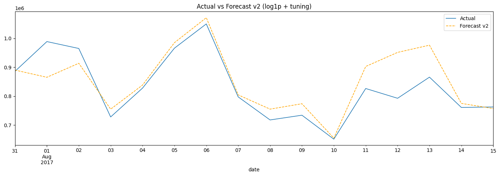

# Store Sales — Time Series Forecasting (Kaggle, топ-7.1%)

**[🇬🇧 English version](README.md)**

**TL;DR.** End-to-end прогнозирование временных рядов на соревновании Kaggle [Store Sales — Time Series Forecasting](https://www.kaggle.com/competitions/store-sales-time-series-forecasting): прогноз дневных продаж на 16 дней вперёд для 1 782 рядов (54 магазина × 33 категории товаров, Corporación Favorita, Эквадор). Чистый, читаемый пайплайн на LightGBM с итеративным прогнозом день за днём даёт **публичный RMSLE 0.39109**; добавление гео-признаков и небольшого ансамбля из двух моделей доводит лучший результат проекта до **0.38803** (топ ~7% на июнь 2026; лидерборд скользящий и со временем заполняется форками публичных ноутбуков). Без стеков из 25 моделей — выигрыш дают честная работа с признаками и аккуратный бленд.

Помимо самой модели, проект документирует **детектив про валидацию** и честную карту того, **что переносится на лидерборд, а что нет**. Первоначальная «честная» итеративная валидация (RMSLE 0.293) оказалась с утечкой обучающего окна; после исправления честная оценка стала 0.399 — почти точно публичный скор. Затем шесть экспериментальных ноутбуков (04–09) проверяют per-family модели, экзогенные признаки и три разные архитектуры, каждый через строгий гейт на 3 окнах. Большинство — **честно описанные отрицательные результаты**, и они сходятся к ясному выводу: на этом соревновании валидационные выигрыши меньше ~0.003 RMSLE не переносятся на публичный тест, поэтому практический потолок принципиального однопайплайнового подхода ≈0.388.

## Результаты

| Шаг | RMSLE |
|---|---:|
| Baseline LightGBM (исходный таргет, 22 признака), валидация 07-31…08-15 | 0.5119 |
| + `log1p`-таргет, 59 признаков (teacher-forcing валидация) | 0.3706 |
| Итеративная валидация, исходная версия — **с утечкой**: финальные модели видели валидационное окно при обучении | ~~0.2928~~ |
| Итеративная валидация после исправления утечки (обучение строго до окна) | **0.3994** |
| **Kaggle Public Leaderboard — чистый пайплайн (ноутбук 03)** | **0.39109** |
| **Kaggle Public Leaderboard — лучший (гео-признаки + ансамбль из двух моделей)** | **0.38803** |

Почти точное совпадение валидации без утечки (0.399) с публичным скором (0.391) — центральный результат: после исправления локальная валидация наконец *предсказывает* поведение на лидерборде. Улучшение до 0.38803 даёт группа `geo` (эксперимент 05) плюс бленд в log-пространстве с моделью, богатой свежими данными, — два *переносимых* изменения; эксперименты 06–09 показывают, что не переносится.



## Стратегия валидации — главное в этом проекте

Большинство time series решений валидируются через *teacher forcing*: лаговые признаки считаются от **фактических** прошлых продаж, включая сам валидационный период. Такая оценка систематически оптимистична — в момент инференса у модели нет фактических продаж за дни, которые она прогнозирует; у неё есть только **её собственные предсказания**.

Здесь валидация устроена ровно так, как модель работает на тесте:

1. Продажи всего валидационного окна (2017-07-31 … 08-15 — точное зеркало 16-дневного test-горизонта) **скрываются**.
2. Прогноз строится **день за днём**: после каждого предсказанного дня все лаги и rolling-средние **пересчитываются из собственных предсказаний модели**, а не из скрытых фактов.
3. Zero-rule (ряды без продаж за последний 21 день прогнозируются нулём) считается **строго по данным до валидации**.
4. Валидационные модели **обучаются строго на данных до окна** (копии `*_val`); полные модели используются только для прогноза теста, где обучение на всём train честно по определению.
5. Веса ансамбля двух финальных моделей (с 2016-01-01 и с 2017-01-01) подбираются на этой честной итеративной валидации.

**Разбор утечки.** В исходной версии пункта 4 не было: финальные модели обучались на *всём* train без верхней отсечки и видели валидационное окно при обучении. Сам цикл валидации был честным — но модели нет. Один этот баг дал RMSLE 0.293 вместо настоящих 0.399 и незаметно перевернул выбор весов ансамбля. Пойман при построении rolling-валидации эксперимента 04.

## Эксперименты (ноутбуки 04–09)

Все эксперименты используют более строгую методологию: **rolling-origin валидация на 3 окнах** (июнь / июль / август 2017, по 16 дней), обучение строго до каждого окна, быстрый матричный движок прогноза (проверен на побитовое совпадение с определениями признаков из ноутбука 02) и **гейт** приёмки: кандидат обязан побить бейзлайн на **всех трёх окнах**, а не в среднем.

**Эксперимент 04 — 33 per-family модели против глобальной.** Чистые per-family модели проигрывают глобальной везде (мало данных, потеряны кросс-категорийные паттерны), но помогают как *примесь*: `25% per-family + 75% глобальная` и пер-категорийный гибрид проходят гейт (среднее 0.3904 против 0.3920). Однако на публичном лидерборде гибрид получил **0.39243 против 0.39109** — валидационный выигрыш не перенёсся. Причина структурная: любое честное до-тестовое окно ставит в невыгодное положение модели, обученные только на свежих данных (модель «с 2017», валидируемая на июльском окне, никогда не видела августа; боевая обучена по 15 августа). Эта премия за свежесть невидима для валидации, заканчивающейся до теста, — поэтому выбор между схемами с разной свежестью данных на таких окнах делать нельзя вообще.

**Эксперимент 05 — экзогенные признаки через реестр групп.** Признаки включаются группами (`FEATURE_GROUPS` / `VARIANTS`), кэш моделей привязан к хэшу активного набора. Две новые группы, точно известные для теста: `payday` (15-е число и конец месяца — зарплатные дни в Эквадоре) и `geo` (город/штат магазина + локальные/региональные праздники по локации магазина). Результат: **`geo` проходит гейт** (лучше бейзлайна на всех 3 окнах, среднее +0.0006) и входит в лучший задеплоенный результат; **`payday` не проходит** (выигрывает июнь, проигрывает июль и август) — честный отрицательный результат.

**Эксперимент 06 — прямой Ridge на ряд (другая парадигма).** Заменяет рекурсивный GBM на 1782 крошечные линейные модели, прогнозирующие все 16 дней сразу. Решительно хуже (среднее ≈0.59 против 0.39): без объединения рядов каждая линейная модель переобучается на свой короткий шумный ряд, а прямая схема теряет сильные короткие лаги. Чёткое опровержение гипотезы «стена лидерборда — это линейная регрессия на ряд»: тащит именно пулинг (одна сильная глобальная модель).

**Эксперимент 07 — динамические фичи + облегчённые гиперпараметры per-family.** Добавляет `growth_ratio`, `dow_mean_4`, `rolling_std_28`, `zero_share_28` (пересчёт из собственных предсказаний в цикле). Помогают на июне/июле, но **вредят на августовском окне** — рекурсивный train/inference дрейф растёт с длиной горизонта и бьёт сильнее всего по самому длинному, самому тест-подобному окну. Гейт провален, сабмишна нет.

**Эксперимент 08 — прямой GBM (без рекурсии).** Сохраняет сильный пулинговый learner, но прогнозирует напрямую из признаков, безопасных на весь горизонт (лаги продаж ≥16, безопасные агрегаты недавнего уровня). Малой дозой 20% в бленде с рекурсивной моделью проходит гейт на валидации — но на лидерборде дал **0.39417**, хуже задеплоенного лучшего. Прямая модель хороша на первой половине августа (валидационное окно W3) и плоха на реальном тесте (16–31 авг): тот же месяц, другая половина. Решающий случай непереноса валидация→паблик.

**Эксперимент 09 — CatBoost как третий родитель бленда (последняя попытка).** Принципиально другая библиотека бустинга (нативные категории, ordered boosting), обученная точно как LightGBM `geo`. Слабее на всех окнах и сильно слабее на августовском, поэтому любой вес бленда ухудшает его там; согласованный заранее структурный порог (≥0.003 по среднему) даже не приближен. «Просто ансамбль LightGBM + CatBoost + XGBoost» здесь не работает — разнообразие помогает, только когда ошибки добавленной модели *другие и не систематически хуже в целевой области*.

**Что перенеслось и где потолок.** Публичный скор улучшили только два изменения: группа `geo` (05) и файловый бленд с моделью, богатой свежими данными — оба *структурные*. Каждый под-~0.003 валидационный выигрыш (гибрид из 04, прямой бленд из 08) на лидерборде оборачивался проигрышем. Разрыв валидация–паблик больше доступных выигрышей, поэтому практический потолок честного однопайплайнового подхода — **≈0.388** (лучший: 0.38803). Оставшаяся дистанция до «стены» ~0.3735 — это растиражированный, накрученный с мультиаккаунтов тюненый ансамбль, а не цель для принципиальной одномодельной работы.

## Продуманные инженерные детали

- **Rolling-признаки без утечки**: каждое скользящее среднее по продажам использует `shift(1)` — текущий день никогда не попадает в собственные признаки.
- **Безопасные лаги транзакций**: `transactions` есть только в train-периоде, поэтому модель использует `transactions_lag_16 … 23` — для любой даты 16-дневного test-горизонта эти лаги гарантированно ссылаются на известные train-данные.
- **Лаги обоснованы анализом, а не взяты наугад**: набор лагов мотивирован ACF/PACF-анализом — короткие 1–6, недельные/месячные 7/14/21/28/42/56 и годовые 364/365.
- **Восстановление календаря**: добавлены пропущенные даты в `train`, `oil` (линейная интерполяция) и `transactions`; 25 декабря добавлено с нулевыми продажами (магазины закрыты).
- **Отдельные флаги событий вместо одного общего**: EDA показывает, что разные события двигают продажи в разные стороны, поэтому в модели отдельные флаги для национальных праздников, Black Friday, Cyber Monday, периода землетрясения Manabí, Navidad, Día de la Madre, футбольных событий и других.
- **Матричный движок прогноза для экспериментов**: данные прямоугольные (1 704 даты × 1 782 ряда), поэтому внутри итеративного цикла лаги считаются срезом строк матрицы продаж — окно валидации прогоняется за секунды вместо минут, что и делает эксперименты «3 окна × много схем» доступными.

## Честно об ограничениях

- **Премию за свежесть нельзя провалидировать.** Боевые модели обучены по 15 августа; любое честное валидационное окно обязано закончиться раньше. Поэтому сравнения схем с разной свежестью обучающих данных не переносятся на лидерборд (измерено напрямую: валидационный выигрыш −0.011 RMSLE обернулся публичным *проигрышем* +0.0013). Сравнения признаков (та же обучающая выборка, та же свежесть) переносятся лучше.
- **`onpromotion` и скользящие средние нефти считаются без `shift(1)` — и здесь это легально.** Промо и цены на нефть известны на test-период по условиям соревнования (это экзогенные входы, а не таргет), поэтому использование их текущих значений — не утечка. Для *продаж* та же конструкция была бы утечкой — поэтому каждый признак на основе продаж сдвинут.

## Что внутри

Пайплайн разбит на ноутбуки — первые три это основной пайплайн, 04–09 это самодостаточные эксперименты, которые его не меняют, 10 — визуализация:

| Ноутбук | Содержание |
|---|---|
| `notebooks/01_eda.ipynb` | Аудит данных, пропуски календаря, распределение таргета (31% нулей), ACF/PACF и STL-декомпозиция, анализ эффектов праздников/событий, магазинов и транзакций → план признаков, выведенный из EDA |
| `notebooks/02_feature_engineering.ipynb` | Восстановление календаря, лаги/rolling/Fourier/события + группы-кандидаты (payday, geo, динамические) → сохраняет `artifacts/features.parquet` (супермножество; ноутбуки выбирают колонки явными списками) |
| `notebooks/03_modeling_submission.ipynb` | Baseline → улучшенная `log1p`-модель → две финальные модели с честными `*_val`-копиями для валидации, итеративная валидация, итеративный test-прогноз → `submission.csv` |
| `notebooks/04_experiment_per_family.ipynb` | Rolling-валидация на 3 окнах, матричный движок, 8 схем (глобальная / per-family / бленды) + сшитые гибриды, гейт, разбор публичного скора |
| `notebooks/05_experiment_features.ipynb` | Реестр групп признаков с хэш-кэшем моделей, A/B групп `payday` и `geo` против бейзлайнов эксперимента 04, гейт → `submission_05_*.csv` |
| `notebooks/06_experiment_direct_ridge.ipynb` | Прямой Ridge на ряд (без рекурсии) — отрицательный результат: решает пулинг, линейная слишком слаба |
| `notebooks/07_experiment_gbm_boost.ipynb` | Динамические фичи (`growth_ratio` и др.) + облегчённые per-family — отрицательный: динамические фичи дрейфуют на августовском окне |
| `notebooks/08_experiment_direct_gbm.ipynb` | Прямой GBM на безопасных фичах ≥16 дней; бленд проходит валидацию, но проваливает лидерборд (ключевой случай непереноса) |
| `notebooks/09_experiment_catboost.ipynb` | CatBoost как третий разнообразящий родитель — отрицательный: слабее именно на августе, гейт отклоняет |
| `notebooks/10_submission_viz.ipynb` | Визуализация сабмишнов по дням: прогнозы в контексте, сравнение по горизонту, отдельные ряды |

Обученные модели кэшируются по паттерну **load-or-train**: если сохранённая модель существует — загружается, иначе обучается и сохраняется. Удалите файлы, чтобы переобучить с нуля.

## Структура проекта

```
├── notebooks/
│   ├── 01_eda.ipynb                   # EDA: календарь, ACF/PACF, STL, события
│   ├── 02_feature_engineering.ipynb   # препроцессинг + признаки → artifacts/
│   ├── 03_modeling_submission.ipynb   # модели, честная итеративная валидация, сабмит
│   ├── 04_experiment_per_family.ipynb # эксперимент: per-family модели, бленды, гибриды
│   ├── 05_experiment_features.ipynb   # эксперимент: группы признаков payday и geo
│   ├── 06_experiment_direct_ridge.ipynb # эксперимент: прямой Ridge на ряд (отрицательный)
│   ├── 07_experiment_gbm_boost.ipynb  # эксперимент: динамические фичи + лёгкие per-family (отрицательный)
│   ├── 08_experiment_direct_gbm.ipynb # эксперимент: прямой GBM без рекурсии (не перенёсся)
│   ├── 09_experiment_catboost.ipynb   # эксперимент: CatBoost-родитель бленда (отрицательный)
│   └── 10_submission_viz.ipynb        # визуализация сабмишнов по дням
├── artifacts/                         # parquet-признаки + кэши экспериментов (не в git)
├── models/                            # обученные LightGBM, load-or-train кэш
├── data/                              # данные соревнования Kaggle (не в git)
├── requirements.txt
├── README.md                          # английская версия (основная)
└── README.ru.md                       # этот файл
```

## Как запустить

```bash
python -m venv .venv
source .venv/bin/activate
pip install -r requirements.txt

# Скачать данные (Kaggle CLI) и распаковать в data/
kaggle competitions download -c store-sales-time-series-forecasting -p data
unzip data/store-sales-time-series-forecasting.zip -d data

# Выполнять ноутбуки по порядку: 01 → 02 → 03 (основной пайплайн); 04 → 05 (эксперименты, опционально)
jupyter notebook notebooks/
```

Примечание: артефакты `models/*.joblib` чувствительны к версиям `lightgbm` / `scikit-learn` — используйте версии из `requirements.txt` либо удалите сохранённые модели, и ноутбуки переобучат их заново. Экспериментальные ноутбуки при первом запуске обучают ~140 моделей LightGBM (несколько часов); все модели и оконные прогнозы кэшируются, повторные запуски занимают минуты.

## Признаки (основные группы)

| Группа | Признаки |
|---|---|
| Календарь | `day_of_week`, `month`, `year`, `is_weekend`, `day_of_year`, `week_of_year`, `date_index` |
| Fourier | `sin_day`, `cos_day`, `sin_week`, `cos_week` |
| История продаж | лаги 1–6, 7, 14, 21, 28, 42, 56, 364, 365; rolling-средние 7/14/28/364 (все через `shift(1)`) |
| Внешние сигналы | `dcoilwtico` (+ MA 7/28), `onpromotion` (+ MA 7/28) |
| Транзакции | `transactions_lag_16 … 23` (без утечки по построению) |
| События | национальные праздники, день перед праздником, Black Friday, Cyber Monday, период землетрясения, именованные праздники, рабочие дни |
| Магазин и товар | `store_nbr`, `store_type`, `cluster`, `family` |
| Зарплаты (эксп. 05, гейт не прошли) | `day_of_month`, `is_payday`, `days_since_payday`, `days_to_payday` |
| География (эксп. 05, гейт прошли) | `city`, `state`, `is_holiday_local`, `is_holiday_regional` |

## Технологии

Python · pandas · NumPy · statsmodels · LightGBM · scikit-learn · matplotlib · seaborn · joblib · pyarrow

## Ключевые выводы

- **Честного цикла валидации мало — модели внутри него тоже должны быть честными.** Итеративный цикл не прикасался к скрытым фактам, но оценка была фантазией, потому что модели видели окно при обучении. Пайплайн без утечек требует *и* честной имитации инференса, *и* честных отсечек обучения.
- **Валидация измеряет качество при своём информационном наборе.** Схемы с разной свежестью обучающих данных нельзя сравнивать на до-тестовых окнах: премия за свежесть боевой модели там невидима, и валидационные победы оборачиваются проигрышем на лидерборде.
- Схема принимается, только если выигрывает на **всех** rolling-окнах, а не в среднем — победители одного окна часто оказываются шумом.
- Разные события двигают продажи в разные стороны — один общий флаг `is_holiday` теряет сигнал; привязка локальных праздников к городу магазина даёт дополнительный, прошедший гейт прирост.
- Когда будущие ковариаты недоступны (транзакции), лаги можно подобрать так, чтобы весь горизонт прогноза ссылался на известные данные — признак без утечки по построению.
- **Ансамбль помогает только при правильном разнообразии.** Бленд лучше родителей, когда они ошибаются *по-разному* и *не систематически хуже в целевой области*. Per-family бленд и гео-признаки этот порог взяли; прямой GBM и CatBoost — нет (оба слабее именно на августе). «Добавь ещё типов моделей» автоматически пользы не даёт.
- **Знай свой потолок.** Шесть экспериментов составили карту того, что переносится (структурные изменения ≥0.003), и что нет (всё меньше). Признать потолок ≈0.388 и остановиться, а не гнаться за стеной из форкнутых ноутбуков — это тоже результат.
- Отрицательные результаты — тоже результаты: линейные модели на ряд, динамические фичи, зарплатные признаки, CatBoost-родитель и две выбранные валидацией схемы, проигравшие на лидерборде, задокументированы в ноутбуках.

## Автор

**Maksym Chunikhin** — [Kaggle](https://www.kaggle.com/maksymchunikhin)
